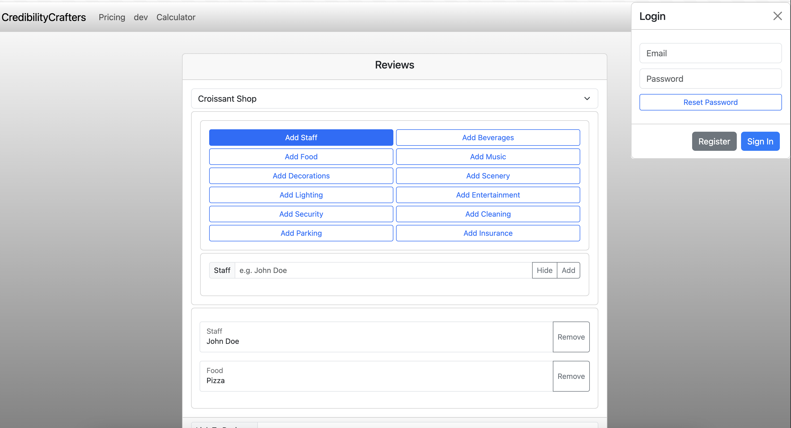

# Webstore for Google Reviews (Discontinued)

This project includes:
- Integration with Google Reviews
- Users can input parameters, and a review will be generated based on those parameters
- Built using [Bootstrap](https://getbootstrap.com) for styling and [Svelte](https://svelte.dev) for building the frontend
- Payment processing is handled with [Stripe](https://stripe.com)
- [Firebase](https://firebase.google.com) is used for authentication and managing user data

